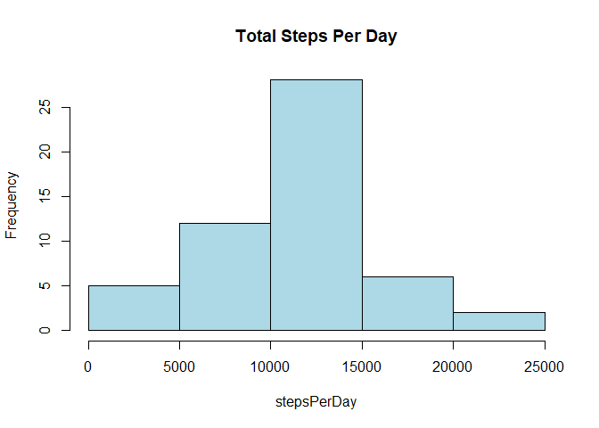
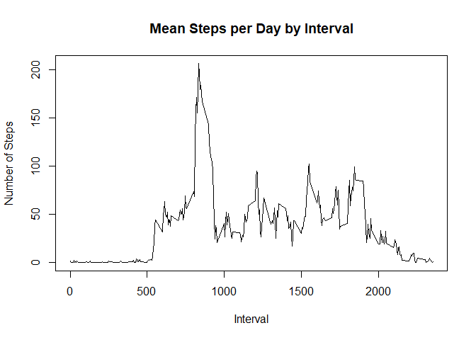
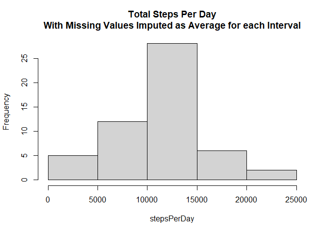
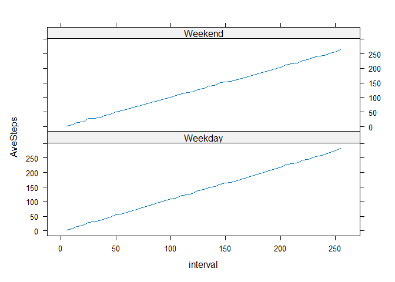

## Course Project 1
# Reproducible Research

```r
library(dplyr)
```

```
## 
## Attaching package: 'dplyr'
```

```
## The following objects are masked from 'package:stats':
## 
##     filter, lag
```

```
## The following objects are masked from 'package:base':
## 
##     intersect, setdiff, setequal, union
```

```r
library(lubridate)
```

```
## 
## Attaching package: 'lubridate'
```

```
## The following objects are masked from 'package:base':
## 
##     date, intersect, setdiff, union
```

```r
library(ggplot2)
library(lattice)
```
## Loading the data from file.
Reading the data from CSV file and displaying the structure of the data.


```r
all_data<- read.csv("activity.csv")
str(all_data)
```

```
## 'data.frame':	17568 obs. of  3 variables:
##  $ steps   : int  NA NA NA NA NA NA NA NA NA NA ...
##  $ date    : chr  "2012-10-01" "2012-10-01" "2012-10-01" "2012-10-01" ...
##  $ interval: int  0 5 10 15 20 25 30 35 40 45 ...
```
## Calculation of total steps per day
Extracting valid data from the overall data where Steps data is present in the records.

Calculating the total steps taken per day.


```r
stepsPerDay<-tapply(all_data$steps[!is.na(all_data$steps)],all_data$date[!is.na(all_data$steps)],sum)
```
## Histogram of total steps per day
plotting histogram of total steps per day for the activity data.


```r
par(mfrow=c(1,1))
hist(stepsPerDay, main="Total Steps Per Day",col = "lightblue")
```

<!-- -->

```r
#dev.off()
```
## Calulate Mean & Median of total steps per day.

Now calculating the mean and median of the total steps taken per day.


```r
stepsPerDayMean<-mean(stepsPerDay[!is.na(stepsPerDay)])
stepsPerDayMedian<-median(stepsPerDay[!is.na(stepsPerDay)])
 
stepsPerDayMean
```

```
## [1] 10766.19
```

```r
stepsPerDayMedian
```

```
## [1] 10765
```

## Mean steps per day by interval


```r
interval_steps <- aggregate(steps ~ interval, all_data, mean)
plot(interval_steps$interval,interval_steps$steps, type="l",xlab="Interval", ylab="Number of Steps",main="Mean Steps per Day by Interval")
```

<!-- -->
## Find maximum number of steps in the 5 min interval.

The 5-minute interval that, on average, contains the maximum number of steps


```r
interval_max <- interval_steps[which.max(interval_steps$steps),1]
interval_max
```

```
## [1] 835
```
## Code to describe and show a strategy for imputing missing data

For imputing the NA values, the mean steps for each interval are calculated and replaced.


```r
intervalNames<-data.frame(rownames(data.frame(interval_steps)))
colnames(intervalNames)<-"interval"

IntervalAverages<-data.frame(c(data.frame(rownames(data.frame(interval_steps))),data.frame(interval_steps)))
colnames(IntervalAverages)<-c("interval","Average_Interval_Steps","Extra")

all_DataImputed <- merge(all_data,IntervalAverages,by="interval")
all_DataImputed[is.na(all_DataImputed$steps),]$steps <-all_DataImputed[is.na(all_DataImputed$steps),]$Average_Interval_Steps
```
## Histogram of the total number of steps taken each day after missing values are imputed

```r
stepsPerDayImputed<-tapply(all_DataImputed$steps,all_DataImputed$date,sum)
hist(stepsPerDay, main="Total Steps Per Day\nWith Missing Values Imputed as Average for each Interval")
```

<!-- -->
## Panel plot comparing the average number of steps taken per 5-minute interval across weekdays and weekends


```r
all_DataImputed$weekdayInd<-with(all_DataImputed, !(weekdays(as.Date(all_DataImputed$date))=="Saturday" | weekdays(as.Date(all_DataImputed$date))=="Sunday")) 

all_DataImputed$TimePeriod[all_DataImputed$weekdayInd==0]<-"Weekend"
all_DataImputed$TimePeriod[all_DataImputed$weekdayInd==1]<-"Weekday"

all_DataImputed.SMRY <- group_by(all_DataImputed, TimePeriod,interval)
all_DataImputed.SMRY<-summarize(all_DataImputed.SMRY, AveSteps = mean(steps, na.rm = TRUE))
```

```
## `summarise()` has grouped output by 'TimePeriod'. You can override using the
## `.groups` argument.
```

```r
xyplot(AveSteps ~ interval | TimePeriod, data = all_DataImputed.SMRY, layout = c(1, 2),type = "l")
```

<!-- -->


